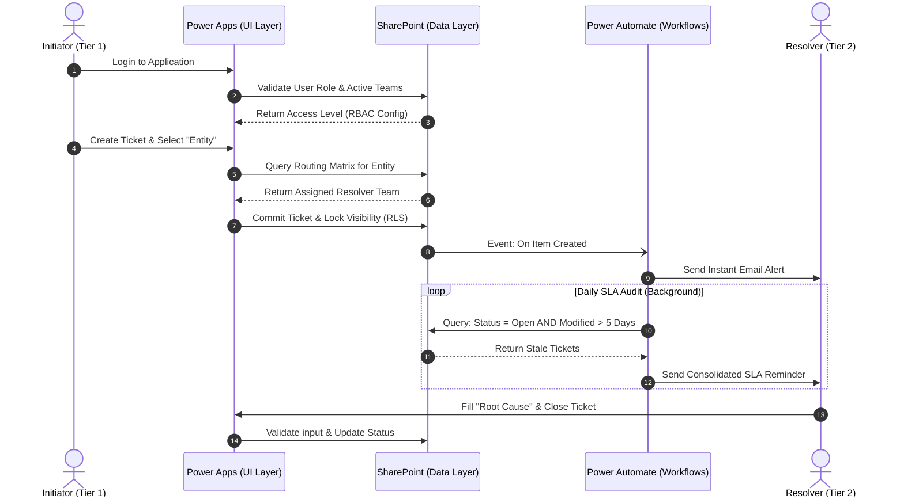

# Incident Data Platform

> **Note:** Anonymized portfolio replica of an internal production system. All proprietary data and identifiers have been sanitized.

**Incident Data Platform** is a comprehensive enterprise-grade application built on the Microsoft Power Platform for incident management, automated task routing, and SLA tracking. Developed entirely within the Microsoft ecosystem, it ensures data security, seamless corporate account integration, and strict Role-Based Access Control (RBAC).

## 📈 Business Impact
Moving from scattered emails to a centralized platform delivered two major operational benefits:

* **Root Cause Analysis & Prevention:** By collecting structured data on every ticket, the business can now identify recurring problems, track top offenders, and fix root causes to reduce the total volume of future incidents.
* **Faster Resolution & Cost Savings:** In logistics, delays generate extra costs. Automated routing and SLA reminders ensure tickets are resolved quickly and never lost, preventing costly operational standstills.

## Database Architecture (SharePoint Lists)
To maintain a unified Microsoft environment, the application relies on SharePoint Lists as its primary data storage. The architecture consists of three relational databases:
1. **Tickets Database:** Stores all incident data (statuses, descriptions, root causes, timestamps, assignees).
2. **Users & Roles Database:** A user directory mapping the "User — Role — Team(s)" relationships.
3. **Routing Database:** A routing matrix linking over 900 unique entities to specific resolution team email addresses for automated task distribution.

## Role-Based Access Control (RBAC) & Dynamic UI
The app automatically authenticates users upon login, dynamically adjusting the interface and access rights. It supports multi-team memberships: users belonging to multiple teams can switch between them in the settings, ensuring ticket visibility remains strictly isolated per active team.

The system features 4 access levels:
* **Initiators (Tier 1 Support):** Can create, edit, and update ticket statuses. They can only view incidents created by their specific team.
* **Resolvers (Tier 2 Operations):** Cannot create tickets but are responsible for resolving them. They only see incidents automatically routed to their designated team.
* **Admin:** Full access to all tickets across the system, directory management, and end-to-end monitoring.
* **Guest / Read-Only:** A fallback role for users not registered in the database. Restricted to a "Read-Only" mode with no permissions to create, edit, or delete records.

## Ticket Lifecycle & Automated Routing
The incident resolution process is heavily automated to eliminate manual triage and assignment errors:

1. **Creation & Auto-Routing:** An Initiator fills out a ticket and selects an "Entity" (from a list of 900+ predefined records). Based on this selection, the app queries the Routing Database and instantly assigns the ticket to the corresponding Resolver team.
2. **Visibility Isolation:** Once created, a ticket is strictly visible *only* to the Initiator team that opened it and the Resolver team assigned to resolve it.
3. **Internal Assignment:** Any member of the assigned Resolver team can claim a ticket or assign it to a teammate. The assignee's name is prominently displayed on the ticket card.
4. **Resolution Validation:** To change a ticket status to "Closed", a strict system check requires the assignee to fill in the "Root Cause" field. Closing the ticket is blocked otherwise.
5. **Re-opening:** If the Initiator team is unsatisfied with the resolution, they have the authority to re-open a closed ticket for further investigation.

## Notification Process (Power Automate)
Background workflows are implemented to accelerate communication and enforce SLAs:
* **Instant Notifications:** Upon ticket creation, a flow automatically compiles the incident details and triggers an email to the assigned Resolver team's group mailbox.
* **SLA & Aging Reminders:** A scheduled flow runs daily to audit the Tickets Database. It filters for open tickets that have had no modifications for over 5 days, generates consolidated lists of these "stale" tickets per team, and sends automated email reminders to prevent tasks from being forgotten.

## Process Flow & Automation Logic

## 🛠️ Technology Stack
* **Frontend:** Microsoft Power Apps (Canvas App)
* **Backend & Data Storage:** SharePoint Lists (Relational Design)
* **Process Automation:** Microsoft Power Automate

## 🚀 Future Enhancements (Analytics Layer)
To further leverage the generated data, the next phase of the platform includes a dedicated **Power BI** integration. This will feature:
* **Interactive Dashboards:** Real-time monitoring of team workloads and bottleneck analysis.
* **Advanced SLA Tracking:** DAX-based metrics to calculate average resolution times and breach rates.
* **Row-Level Security (RLS):** Ensuring that managers and executives only see analytics relevant to their organizational hierarchy.
